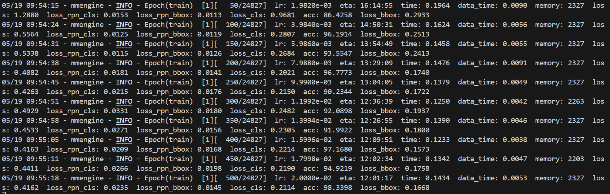
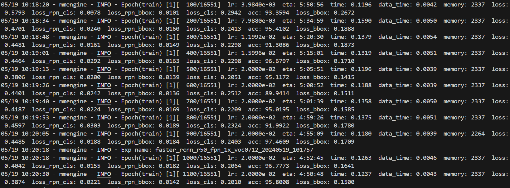
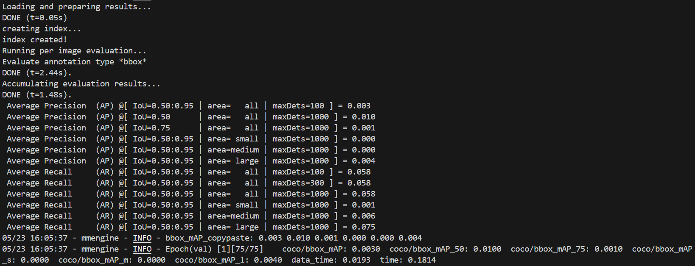
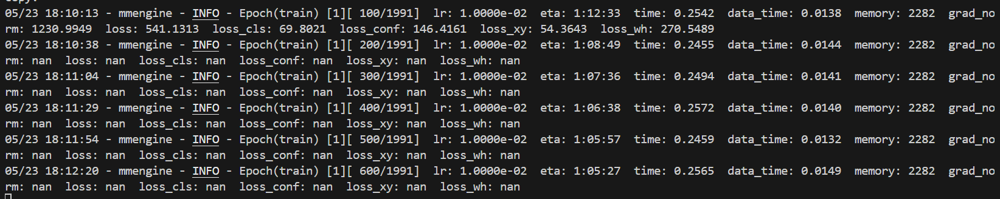
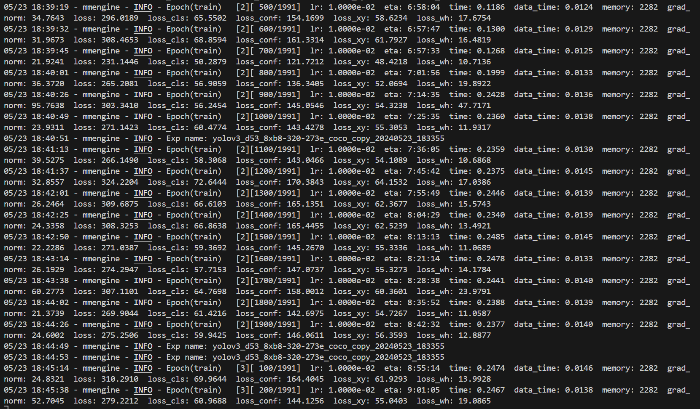

# Faster R-CNN  and  YOLO V3

## 权重文件

链接：https://pan.baidu.com/s/1fNdK7LiAIKFN2yX6jw-CVw?pwd=nv41 
提取码：nv41 
--来自百度网盘超级会员V7的分享

## 配置环境

```bash
git clone https://github.com/open-mmlab/mmdetection.git
cd mmdetection
pip install -r requirements/build.txt
pip install -v -e .
```

## 下载&解压数据集

```bash
mkdir VOCdevkit
cd VOCdevkit
wget http://host.robots.ox.ac.uk/pascal/VOC/voc2007/VOCtrainval_06-Nov-2007.tar
wget http://host.robots.ox.ac.uk/pascal/VOC/voc2007/VOCtest_06-Nov-2007.tar
tar -xvf VOCtrainval_06-Nov-2007.tar
tar -xvf VOCtest_06-Nov-2007.tar
```

## Faster R-CNN

###  配置Faster R-CNN模型

#### 下载预训练模型

```bash
wget https://download.openmmlab.com/mmdetection/v2.0/faster_rcnn/faster_rcnn_r50_fpn_1x_coco/faster_rcnn_r50_fpn_1x_coco_20200130-047c8118.pth -P checkpoints/
```

#### 更改配置文件

因为使用的是VOC数据集，所以需要修改模型文件，复制一个Faster R-CNN的配置文件`faster-rcnn_r50_fpn_1x_coco.py`，并重命名为`faster_rcnn_r50_fpn_1x_voc0712.py`。然后更改配置文件内容如下：

```python
_base_ = [
    '../_base_/models/faster-rcnn_r50_fpn.py',
    '../_base_/datasets/voc0712.py',
    '../_base_/schedules/schedule_1x.py', '../_base_/default_runtime.py'
]

# 模型设置
model = dict(
    roi_head=dict(
        bbox_head=dict(num_classes=20)))  # VOC数据集有20个类别

# 预训练权重
load_from = 'checkpoints/faster_rcnn_r50_fpn_1x_coco_20200130-047c8118.pth'
```

### 训练阶段

```bash
 python tools/train.py configs/faster_rcnn/faster_rcnn_r50_fpn_1x_voc0712.py
```

#### 第一次训练

参数：

1. `faster-rcnn_r50_fpn.py`
2. `schedule_1x.py`
   - `max_epochs = 12`
   - `type='SGD', lr=0.02, momentum=0.9, weight_decay=0.0001`
   - `epoch=12`
   - 补充：{schedule}： 训练方案，选项是 1x、 2x、 20e 等。**1x 和 2x 分别代表 12 epoch 和 24 epoch**，20e 在级联模型中使用，表示 20 epoch。对于 1x/2x，初始学习率在第 8/16 和第 11/22 epoch 衰减 10 倍；对于 20e ，初始学习率在第 16 和第 19 epoch 衰减 10 倍
3. `voc0712.py`
   - `batch size = 2(train),1(val)`
   - `times = 3`

训练结果展示：

1. `eta`（预计剩余时间）字段表示预计完成整个训练所需的时间。当前显示的`eta`是12-13h，**训练时间过长**，因此要更改参数！并且预训练模型非常不错，loss很低，准确率很高基本在**90%以上**
2. `mmengine - WARNING - The model and loaded state dict do not match exactly`` unexpected key in source state_dict: fc.weight, fc.bias`存在**模型和加载的状态字典不完全匹配、尺寸不匹配 (size mismatch)**的问题，主要是因为用的COCO模型预训练参数，种类不同。

#### 第二次训练

修改配置文件如下：

1. `configs/_base_/models/faster-rcnn_r50_fpn voc.py`修改为20类
2. `configs/_base_/datasets/voc0712 copy1.py`
   - 增加线程`num_workers=8`
   - 增加`bacth_size=4`
   - `times` 参数在 `RepeatDataset` 中用于指定数据集重复的次数。它的作用是将数据集复制多次，以增加训练过程中每个 epoch 中的数据量。修改为`times=2`
3. `configs/_base_/schedules/schedule_1x copy1.py`修改为只训练8个epoch，`milestones=[5,7]`, 在第4个和第6个epoch时下降学习率
4. `configs/_base_/default_runtime copy1.py`修改为添加混合精度训练配置`fp16 = dict(loss_scale='dynamic')`

训练结果展示：

显著降低了训练时间，但碍于**实验室GPU资源有限**，想要把训练时间降低到**3h左右**

#### 第三次训练

考虑到VOC训练集数据量大小与原本配置文件更适用于小数据集的特点，修改配置文件如下：

1. `configs/_base_/datasets/voc0712 copy1.py`
   - 增加`bacth_size=8`
   - 线程改回`num_workers=8`(GPU内存不足)
   - 修改为`times=1`

训练结果良好，以下是每个批次的运行结果


##### 第8 epoch后**测试集**结果分析：

- **gts (ground truths)**: 实际目标数，即数据集中每个类别的实际目标数量。

- **dets (detections)**: 检测到的目标数，即模型检测到的每个类别的目标数量。

- **recall**: 召回率，表示模型能够正确检测到的实际目标的比例。计算公式为 recall=TPTP+FNrecall=TP+FNTP，其中 TPTP 是真正例，FNFN 是假负例。
  - **召回率最高的**类别是`dog`，达到 **0.975**，表明模型在检测dog目标时非常可靠，能够检测到几乎所有的实际目标。
  - **召回率较低**的类别是`bottle`，只有 **0.691**，表明模型在检测bottle目标时存在一定的漏检情况，可能需要进一步改进。

- **ap (average precision)**: 平均精度，表示模型在每个类别上的精度。计算公式涉及召回率和精确率的曲线积分。
  - **平均精度最高的类别是`bicycle`和`dog`**，都达到了 0.879 和 0.862，表明模型在这些类别上不仅检测准确，而且定位精确。
  - **平均精度较低的类别是`bottle`和`pottedplant`**，分别只有 0.584 和 0.592，表明模型在这些类别上可能存在较多的误检或定位不准确的问题。

- **mAP (mean Average Precision)**: 平均平均精度，表示模型在所有类别上的平均精度，是衡量目标检测模型性能的综合指标。
  - **模型的总体平均精度（mAP）为 0.806**，这表明模型在所有类别上的平均表现还是相当不错的，但仍有一定的提升空间。

将测试集结果可视化（bash命令行方式尝试多次依旧有bug，选择自行使用json文件生成图像）：

```python
# Plot pascal_voc/mAP
plt.figure(figsize=(10, 5))
plt.plot(steps, pascal_voc_mAP, label='pascal_voc/mAP', marker='o')
plt.xlabel('Step')
plt.ylabel('pascal_voc/mAP Value')
plt.title('Pascal VOC mAP over Steps')
plt.legend()
plt.grid(True)
plt.savefig("/mnt/data/pascal_voc_mAP.png")
plt.show()

# Plot pascal_voc/AP50
plt.figure(figsize=(10, 5))
plt.plot(steps, pascal_voc_AP50, label='pascal_voc/AP50', marker='x')
plt.xlabel('Step')
plt.ylabel('pascal_voc/AP50 Value')
plt.title('Pascal VOC AP50 over Steps')
plt.legend()
plt.grid(True)
plt.savefig("/mnt/data/pascal_voc_AP50.png")
plt.show()
```

结果如下：


##### 最后生成的目录文件：


因为有events.out.tfevents文件，故可以进行**Tensorboard可视化**，代码如下：

```bash
tensorboard --logdir=work_dirs/faster_rcnn_r50_fpn_1x_voc0712
```

##### 可视化**训练集**结果如下：

1. 准确率accuracy曲线

2. 学习率learning rate曲线

3. 总损失函数**Loss**曲线
4. 分类损失**Loss_Cls**曲线
5. 边界框回归损失**Loss_Bbox**曲线
6. RPN分类损失**Loss_RPN Cls**曲线
7. RPN边界框回归损失**Loss_RPN Bbox**曲线

###### 结果分析：

- 模型的准确率和总损失曲线表现良好，表明模型在训练过程中不断优化并达到了较高的准确率。
- 分类损失和边界框回归损失曲线均呈下降趋势，表明模型在这两个任务上的表现不断改进。
- RPN的分类和边界框回归损失曲线也表现良好，表明RPN在提议区域的分类和回归任务上表现不断改进。
- 学习率曲线显示了合理的学习率调度，帮助模型在训练初期快速收敛，并在后期进行精细调整。
- 其中在**第六次 epoch 左右学习率的显著下降**对各个损失和准确率都产生了积极的影响。学习率下降后：
  - **准确率**：波动减少，并逐渐上升，表明模型在后期的训练更加稳定，并逐渐达到更高的准确率。
  - **总损失和各项子损失**：均在第六次 epoch 左右显著下降，随后损失减少的速度变得更加平稳。这表明较低的学习率帮助模型在训练后期更加精细地优化参数。

### 性能测试阶段

```bash
python tools/test.py configs/faster_rcnn/faster_rcnn_r50_fpn_1x_voc0712.py work_dirs/faster_rcnn_r50_fpn_1x_voc0712/epoch_8.pth --out results.pkl
```

结果如图所示：

可视化性能测试：

1. 从测试集中取出识别效果最好的20张和最坏的20张（*完成作业基本要求2*）

```bash
python tools/analysis_tools/analyze_results_copy.py configs/faster_rcnn/faster_rcnn_r50_fpn_1x_voc0712.py results.pkl results --topk 20
```

出现异常错误`AttributeError: 'ConfigDict' object has no attribute 'pipeline`，经查是因为**新版mmdetection出现了不兼容问题**，故修改分析脚本 `tools/analysis_tools/analyze_results.py` 中的代码，以确保其能够正确读取配置文件中的 `pipeline` 定义

选取四张还不错的图片如下：


2. 画出混淆矩阵图像

```bash
python tools/analysis_tools/confusion_matrix.py configs/faster_rcnn/faster_rcnn_r50_fpn_1x_voc0712.py results.pkl work_dirs/faster_rcnn_r50_fpn_1x_voc0712 --show
```


## YOLO v3

### 数据集转化

YOLO只能识别coco数据集，所以**将VOC数据集转化为coco数据集**，新建文件`voc_to_coco.py`，其中`val_files_num = 600,test_files_num = 600`，对VOC数据集进行转化。

### 训练阶段

对原有的`configs/yolo/yolov3_d53_8xb8-ms-608-273e_coco.py`进行修改，新文件`configs/yolo/yolov3_d53_8xb8-ms-608-273e_coco_copy.py`

1. 更改`_base_ = ['../_base_/schedules/schedule_1x copy1.py', '../_base_/default_runtime copy1.py']`

2. 更改`num_classes=20`，线程增加为`num_workers=8`

3. 修改checkpoints保存`interval=1`，修改训练`epoch=8`，每1epoch保存一次，每1epoch进行一次验证

4. 更改文件读取的位置

5. 新增预训练的模型`checkpoints/yolov3_d53_mstrain-608_273e_coco_20210518_115020-a2c3acb8.pth`

6. 新增类别以及锚框颜色

   ```python
   metainfo = {
       'classes': (
           'aeroplane', 'bicycle', 'bird', 'boat', 'bottle',
           'bus', 'car', 'cat', 'chair', 'cow',
           'diningtable', 'dog', 'horse', 'motorbike', 'person',
           'pottedplant', 'sheep', 'sofa', 'train', 'tvmonitor'
       ),
       'palette': [
           [128, 0, 0], [0, 128, 0], [128, 128, 0], [0, 0, 128], [128, 0, 128],
           [0, 128, 128], [128, 128, 128], [64, 0, 0], [192, 0, 0], [64, 128, 0],
           [192, 128, 0], [64, 0, 128], [192, 0, 128], [64, 128, 128], [192, 128, 128],
           [0, 64, 0], [128, 64, 0], [0, 192, 0], [128, 192, 0], [0, 64, 128]
       ]
   } 
   ```

```bash
python tools/train.py configs/yolo/yolov3_d53_8xb8-ms-608-273e_coco_copy.py
```

#### 第一次训练



训练结果**奇差无比**，没有一个准确率高于0.01，尝试更换一下预训练模型，看是否可以。尝试用DarkNet-53 608 混合精度，发现依旧很差，打算**更换使用的模型并且增大学习率**：更改学习率为`lr=0.01`

#### 第二次训练

```
python tools/train.py configs/yolo/yolov3_d53_8xb8-320-273e_coco_copy.py
```



直接梯度爆炸，所以再次更改`epoch =100，milestones=[50, 75]，lr = 0.01`

#### 第三次训练



**loss依旧很高，没有办法**，只能继续运行，但是**运行时间过久**。后查询相关资料发现YOLO收敛速度确实会更慢一点，因此更改最终参数如下：

1. 修改 `train_dataloader`,`test_dataloader`,`val_dataloader`

   ```python
   train_dataloader = dict(
       batch_size=16, # 增加batch_size
       num_workers=16, # 增加通道数
       persistent_workers=True,
       sampler=dict(type='DefaultSampler', shuffle=True),
       batch_sampler=dict(type='AspectRatioBatchSampler'),
       dataset=dict(
           type=dataset_type,
           metainfo = metainfo, # 增加新的类别识别
           data_root=data_root,
           ann_file='annotations/train2017.json', # 更改文件位置
           data_prefix=dict(img='images/'), # 更改文件位置
           filter_cfg=dict(filter_empty_gt=True, min_size=32),
           pipeline=train_pipeline,
           backend_args=backend_args))
   
   val_dataloader = dict(
       batch_size=16, # 增加batch_size
       num_workers=16, # 增加通道数
       persistent_workers=True,
       drop_last=False,
       sampler=dict(type='DefaultSampler', shuffle=False),
       dataset=dict(
           type=dataset_type,
           metainfo = metainfo, # 增加新的类别识别
           data_root=data_root,
           ann_file='annotations/val2017.json', # 更改文件位置
           data_prefix=dict(img='images/'), # 更改文件位置
           test_mode=True,
           pipeline=test_pipeline,
           backend_args=backend_args))
   test_dataloader = val_dataloader
   ```

2. 训练周期epoch

   ```python
   train_cfg = dict(max_epochs=273, val_interval=7) # 最大训练周期max_epoch=273，每7epoch验证一次
   ```

3. 优化器optimizer：学习率0.001，选用SGD，动量0.9，权重衰减0.0005，还有梯度衰减

   ```python
   optim_wrapper = dict(
       type='OptimWrapper',
       optimizer=dict(type='SGD', lr=0.001, momentum=0.9, weight_decay=0.0005),
       clip_grad=dict(max_norm=35, norm_type=2))
   ```

4. 学习策略learning policy：使用学习率调度器 LinearLR，在前 1000 次迭代中学习率增加到 0.01。 使用多步学习率调整策略，在第 218 和第 246 个 epoch 时下降学习率，gamma=0.1

   ```python
   # learning policy
   param_scheduler = [
       dict(type='LinearLR', start_factor=0.1, by_epoch=False, begin=0, end=1000), 
       dict(type='MultiStepLR', by_epoch=True, milestones=[218, 246], gamma=0.1)
   ]
   ```

5. 权重保存策略CheckpointHook

   ```python
   default_hooks = dict(checkpoint=dict(type='CheckpointHook', interval=7)) # 每7epoch保存一下权重
   ```

#### 第四次训练


训练结果解析：

##### 平均精度 （Average Precision）

- 在`IoU阈值从0.50到0.95之间`的所有目标上的值为0.379
- 在`IoU=0.50`时的**所有目标上的平均精度为0.579**
- 在`IoU=0.75`时的**所有目标上的平均精度为0.410**
- 在`IoU阈值从0.50到0.95之间`的小目标上的平均精度为0.023
- 在`IoU阈值从0.50到0.95之间`的中等目标上的平均精度为0.189
- 在`IoU阈值从0.50到0.95之间`的**大目标上的平均精度为0.466**

##### 平均召回率 （Average Recall）

- 在`IoU阈值从0.50到0.95之间`的**所有目标上的值为0.482**
- 在`IoU阈值从0.50到0.95之间`的**所有目标上的值为0.482**
- 在`IoU阈值从0.50到0.95之间`的**所有目标上的值为0.482**
- 在`IoU阈值从0.50到0.95之间`的小目标上的值为0.038
- 在`IoU阈值从0.50到0.95之间`的中等目标上的值为0.274
- 在`IoU阈值从0.50到0.95之间`的**大目标上的值为0.567**

##### 结论

- 整体上，模型在IoU阈值从0.50到0.95之间的平均精度为0.379，平均召回率为0.482。
- **在特定的IoU阈值下（例如0.50和0.75）**，模型的表现更好，平均精度分别为0.579和0.410
- 对于不同尺度的目标，**小目标的检测效果较差**（AP=0.023，AR=0.038），而**大目标的检测效果较好**（AP=0.466，AR=0.567）

##### 可视化Tensorboard结果

先使用json转Tensorboard文件格式的程序，将数据文件转化为Tensorboard之后进行可视化。

```python
import json
from torch.utils.tensorboard import SummaryWriter

with open(r'/mnt/ly/models/mmdetection/mmdetection-main/work_dirs/yolov3/3/20240525_063445/vis_data/scalars.json', 'r') as f:
    data = [json.loads(line) for line in f]

writer = SummaryWriter(log_dir=r"/mnt/ly/models/mmdetection/mmdetection-main/work_dirs/yolov3/3/20240525_063445/vis_data/tensorboard/")

for entry in data:
    step = entry.pop('step')
    for key, value in entry.items():
        writer.add_scalar(key, value, step)

writer.flush()
writer.close()
```

可视化结果如下：

1. **lr**学习率

   

2. **grad_norm**梯度范数：从图中看出梯度范数稳定，说明模型在训练过程中未出现梯度爆炸或消失的情况。

   

3. 损失函数

   1. **loss**总体损失：逐渐下降，表明模型在不断学习，收敛情况较好。

      

   2. **loss_cls**分类损失：整体下降，训练过程稳定，收敛效果好。

      

   3. **loss_conf**置信度损失：变化趋势和总体损失相似，收敛效果良好。

      

   4. **loss_wh**宽高损失：初期波动大，后期趋于稳定，表现良好。

      

   5. **loss_xy**中心点位置损失：整体波动较大，但总体呈下降趋势。

      

4. COCO mAP指标

   1. **coco/bbox_mAP**总体mAP的变化：从图中可以看出mAP在前期波动较大，后期逐渐稳定在0.37左右

      

   2. **coco/bbox_mAP_50**IoU为0.5时的mAP：波动较大，但整体趋于稳定，最终值在0.57左右

      

   3. **coco/bbox_mAP_75**IoU为0.75时的mAP：初期波动大，后期稳定在0.41左右

      

   4. **coco/bbox_mAP_s**对小目标的mAP表现：波动较大且值较低，稳定在0.02左右

      

   5. **coco/bbox_mAP_m**对中等目标的mAP表现：稳定在0.19左右

      

   6. **coco/bbox_mAP_l**对大目标的mAP表现：趋于稳定，值在0.46左右

      

#### 性能测试阶段

```bash
python tools/test.py configs/yolo/yolov3_d53_8xb8-320-273e_coco_copy.py work_dirs/cfm/yolov3/3/epoch_273.pth --out results_yolo.pkl
```


可视化性能测试：

1. 从测试集中取出识别效果最好的20张和最坏的20张（*完成作业基本要求2*）

```bash
python tools/analysis_tools/analyze_results_copy.py configs/yolo/yolov3_d53_8xb8-320-273e_coco_copy.py results_yolo.pkl results --topk 20
```

选取四张还不错的图片如下：


2. 画出混淆矩阵

   ```bash
   python tools/analysis_tools/confusion_matrix.py configs/yolo/yolov3_d53_8xb8-320-273e_coco_copy.py results_yolo.pkl work_dirs/yolov3_d53_8xb8-320-273e_coco_copy --show
   ```

   

这说明还没有训练到最后，还可以继续加epoch，继续降低学习率。

ps：跟几个朋友交流了一下，还是有可能我的预训练权重加载有问题，否则不会训练这么久（气）

## 二者的对比

在网上随意选择三张图片，测试faster-RCNN和YOLO的对比效果

```bash
python work_dirs/cfm/yolov3/test.py
```


结论：两者对比非常明显，faster-rcnn明显更加“激进”，而YOLOv3总体上更加“谨慎保守”；

- **Faster R-CNN** 在不同场景中显示出更高的置信度和更精确的边界框。
- **YOLOv3** 表现相当，但有时置信度较低且检测数量较少。可能是因为训练epoch太少，收敛效果不理想。
